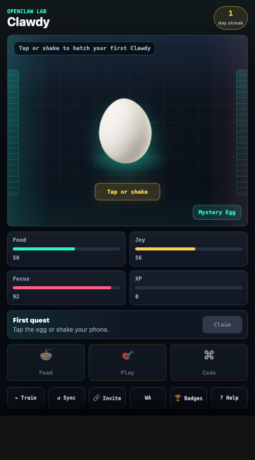

# 🐣 OpenClaw Pet - Telegram Mini App

> Telegram-first agent virtual pet that grows from OpenClaw and Hermes activity.



## 🎮 Features

- 🐣 5 Evolution Stages (Tiny Claw → Baby Bot → Code Cub → Build Beast → Claw Legend)
- 🥚 Tap-or-shake hatch moment for first-time users
- 🍕 Feed, 🎮 Play, 💻 Code care loop
- 📊 Synced progress via OpenClaw memory files
- 🔄 Real OpenClaw activity sync from the deploy host
- 🏆 Daily quests, streaks, badges, and evolution
- ⌁ Agent Training for Telegram-first pet growth
- 🔗 Telegram invite and WhatsApp share link
- 🧪 Claude/Codex/browser guest fallback

## 🚀 Setup

### 1. Create Bot
```bash
# Talk to @BotFather
/newbot
# Get your BOT_TOKEN
```

### 2. Configure
```bash
cp .env.example .env
# Add BOT_TOKEN and HTTPS WEBAPP_URL
```

### 3. Deploy
```bash
npm install
npm run check
npm run audit:submission
npm run telegram:configure
npm start
```

Required production env:

- `BOT_TOKEN`: Telegram bot token from BotFather
- `WEBAPP_URL`: HTTPS URL configured as the BotFather Main Mini App
- `OPENCLAW_PET_MEMORY_DIR`: persistent OpenClaw memory folder for user state
- `OPENCLAW_ACTIVITY_DIR`: OpenClaw activity folder used for daily sync signals
- `TELEGRAM_UPDATE_MODE`: `polling` by default; use `webhook` only after HTTPS is live
- `TELEGRAM_WEBHOOK_SECRET`: required by `npm run preflight` when webhook mode is enabled
- `PORT`: server port, defaults to `3000`

## 🎯 Usage

1. Start bot: `/start`
2. Click "🎮 Open Pet" button
3. Use Agent Training, OpenClaw Sync, and daily care actions.

## 📱 Telegram Mini App

- Works on all platforms (iOS, Android, Desktop)
- Validates Telegram `initData` for synced state endpoints
- Uses guest localStorage only outside Telegram
- Supports `/agent`, `/sync`, `/privacy`, and `/help`
- Configure BotFather Main Mini App, splash screen, screenshots, and demo video before Apps Center resubmission

## ✅ Resubmission

Use [`PRODUCTION_INPUTS.md`](./PRODUCTION_INPUTS.md), [`DEPLOYMENT.md`](./DEPLOYMENT.md), [`BOTFATHER_PACKET.md`](./BOTFATHER_PACKET.md), the PNG files in [`assets/`](./assets), [`APP_CENTER_SUBMISSION.md`](./APP_CENTER_SUBMISSION.md), [`PRODUCT_REVIEW.md`](./PRODUCT_REVIEW.md), [`GOAL_AUDIT.md`](./GOAL_AUDIT.md), [`LIVE_TEST_RESULTS.md`](./LIVE_TEST_RESULTS.md), and [`SUBMISSION_CHECKLIST.md`](./SUBMISSION_CHECKLIST.md) before sending the app back to Apps Center.

## GitHub Pages Demo

The GitHub Pages workflow deploys `public/` as a static demo. This is only a preview surface; Telegram `initData` and OpenClaw memory sync still require the Node backend described in `DEPLOYMENT.md`.

---

<div align="center">
  <sub>Built with 💜 by <strong>TURAC</strong></sub>
</div>
